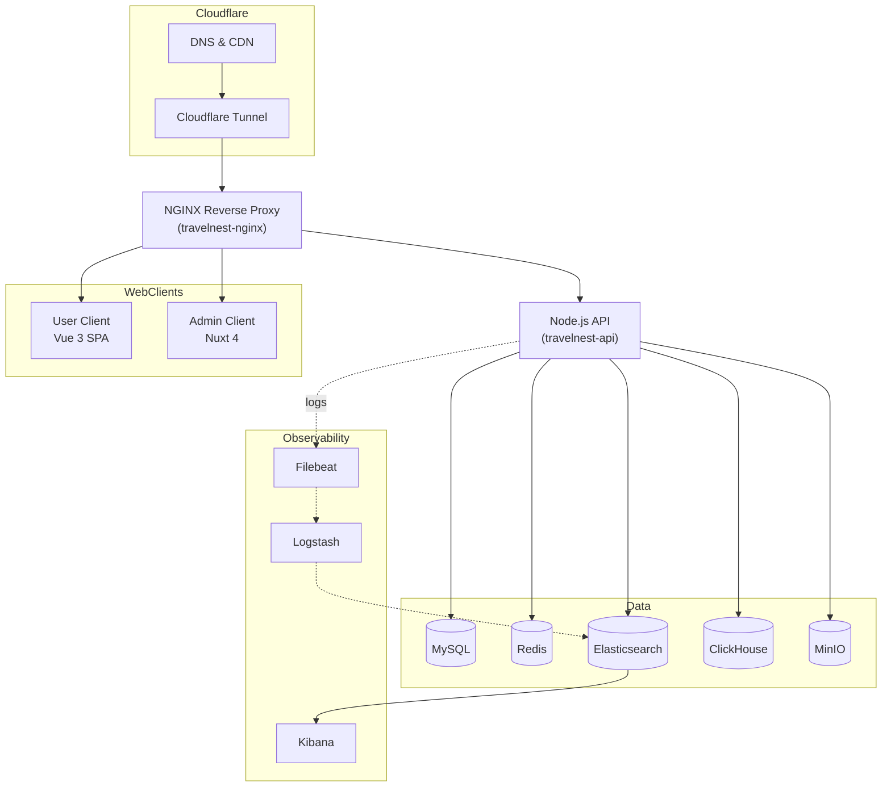

# TravelNest Deployment & Infrastructure

This directory contains automation and configuration for deploying the full TravelNest stack
onto a VPS using Docker Compose, Nginx, Cloudflare Tunnel, and an observability stack.

## High‑Level Architecture



## Quick Start

Run these commands on your VPS to bootstrap the infrastructure:

```bash
# 1. Clone this repository (or deployment-only mirror) on your VPS
git clone <your-repo-url> /tmp/travelnest-deploy
cd /tmp/travelnest-deploy/deploy

# 2. Run the main setup script
sudo bash scripts/setup-all.sh

# 3. Edit environment variables
nano /opt/travelnest/.env

# 4. Start services
cd /opt/travelnest
docker compose up -d

# 5. Run post-deployment setup (indexes, health checks, etc.)
bash scripts/post-deploy.sh
```

> For a step‑by‑step explanation of everything that script does, see `docs/VPS_SETUP_GUIDE.md`
> and `docs/VPS_SETUP_COMPLETE.md`.

## What Gets Installed

- Core system packages (Docker, Git, UFW, Fail2ban, etc.)
- Application directory structure under `/opt/travelnest`
- Docker Compose stack for:
  - Nginx reverse proxy
  - API (Node.js)
  - MySQL, Redis
  - MinIO object storage
  - Elasticsearch, ClickHouse
  - Filebeat, Logstash, Kibana (ELK stack)
- Backup scripts and cron jobs
- Basic security hardening (firewall, SSH, Fail2ban)

## Directory Structure (on VPS)

```text
/opt/travelnest/
├── docker-compose.yml
├── .env
├── nginx/
│   ├── nginx.conf
│   └── conf.d/
├── elasticsearch/
│   ├── config/
│   └── mapping/
├── logstash/
│   ├── config/
│   └── pipeline/
├── filebeat/
├── clickhouse/
│   └── init/
├── data/
├── logs/
└── backups/
```

## Scripts Overview

All scripts live under `deploy/scripts` and are orchestrated by `setup-all.sh`.

| Script                  | Description                              |
| ----------------------- | ---------------------------------------- |
| `setup-all.sh`          | Main orchestrator – runs all setup steps |
| `01-install-packages.sh`| Install system packages                  |
| `02-setup-directories.sh` | Create directory structure and permissions |
| `03-setup-docker.sh`   | Configure Docker and user groups         |
| `04-setup-firewall.sh` | Configure UFW firewall                   |
| `05-deploy-configs.sh` | Copy all configuration files             |
| `post-deploy.sh`       | Initialize services after first start    |
| `backup-setup.sh`      | Setup automated backups and cron jobs    |
| `health-check.sh`      | Check system and container health        |

## Manual Steps Required

1. **Generate SSH keys** for CI/CD deployment to the VPS.
2. **Configure GitHub Secrets** with SSH keys, Docker Hub credentials, and `.env` content.
3. **Set up Cloudflare Tunnel** to expose the VPS securely.
4. **Update `/opt/travelnest/.env`** with strong passwords and production URLs.
5. **Configure DNS** records in Cloudflare for your domains.

The detailed commands and configuration examples are in:

- `docs/VPS_SETUP_GUIDE.md`
- `docs/VPS_SETUP_COMPLETE.md`

## Cloudflare Tunnel (Overview)

Cloudflare Tunnel terminates HTTPS at Cloudflare and forwards traffic to Nginx on your VPS.
The full setup (installation, tunnel config, DNS) is described in `docs/VPS_SETUP_COMPLETE.md`.

## CI/CD & Deployment Flow

The CI/CD pipelines in GitHub Actions build Docker images for:

- Backend API (`server`)
- User client (`client`)
- Admin client (`admin-client`)

Those images and static assets are deployed onto the `/opt/travelnest` stack on the VPS.  
For a complete description of the pipelines and deployment strategy, see:

- `docs/CICD.md`

## Documentation

- `docs/VPS_SETUP_GUIDE.md` – base VPS preparation and hardening
- `docs/VPS_SETUP_COMPLETE.md` – full infrastructure setup (ELK, ClickHouse, Nginx, etc.)
- `docs/CICD.md` – CI/CD pipeline and deployment details
- `docs/INFRA_SETUP.txt` – in-depth infrastructure design and architecture notes

## Roadmap

- [ ] Add fully automated restore-from-backup scripts and documentation.
- [ ] Introduce staging environment deployment alongside production.
- [ ] Add Prometheus + Grafana dashboards for metrics and alerting.
- [ ] Harden secrets management (external secret store instead of raw `.env`).
- [ ] Improve blue/green or canary deployment support for the API and frontends.

