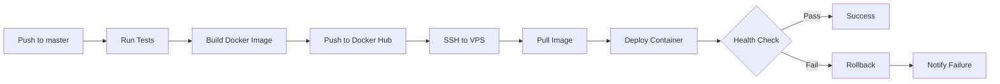
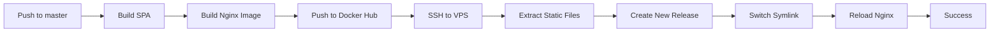

# CI/CD Pipeline Documentation

This document describes the GitHub Actions CI/CD pipelines for TravelNest.

## Overview

We have **3 separate pipelines** for each application component:

1. **Backend API** (`.github/workflows/backend.yml`)
2. **Frontend User Client** (`.github/workflows/frontend.yml`)
3. **Admin Client** (`.github/workflows/admin-client.yml`)

Each pipeline includes:
- ✅ Linting & Code Quality
- ✅ Testing (unit, integration)
- ✅ Docker Image Building
- ✅ Automated Production Deployment
- ✅ Post-Deployment Verification

---

## Pipeline Architecture

```
┌─────────────────────────────────────────────────────────────────┐
│                        GitHub Actions                            │
└─────────────────────────────────────────────────────────────────┘
                              │
                              ▼
┌─────────────────────────────────────────────────────────────────┐
│  Stage 1: Lint & Test                                           │
│  - ESLint, Prettier                                             │
│  - Unit tests, Integration tests                                │
│  - Code coverage                                                │
└─────────────────────────────────────────────────────────────────┘
                              │
                              ▼
┌─────────────────────────────────────────────────────────────────┐
│  Stage 2: Build & Push Docker Image                             │
│  - Build Docker image                                           │
│  - Tag with branch name, SHA, latest                            │
│  - Push to Docker Hub                                           │
└─────────────────────────────────────────────────────────────────┘
                              │
                              ▼
┌─────────────────────────────────────────────────────────────────┐
│  Stage 3: Deploy to Production (master branch only)             │
│  - SSH into VPS                                                 │
│  - Pull latest Docker image                                     │
│  - Deploy with zero-downtime strategy                           │
│  - Health check verification                                    │
│  - Automatic rollback on failure                                │
└─────────────────────────────────────────────────────────────────┘
                              │
                              ▼
┌─────────────────────────────────────────────────────────────────┐
│  Stage 4: Post-Deployment Tests                                 │
│  - Smoke tests                                                  │
│  - Database connectivity                                        │
│  - Service availability                                         │
└─────────────────────────────────────────────────────────────────┘
```

---

## 1. Backend API Pipeline

**File:** `.github/workflows/backend.yml`

### Triggers

- Push to `master`, `develop`, `staging` branches
- Pull requests to these branches
- Manual workflow dispatch
- When `server/**` files change

### Jobs

#### 1.1 Lint and Test
- **Matrix:** Node.js 18.x and 20.x
- **Steps:**
  - Checkout code
  - Install dependencies
  - Run ESLint
  - Check code formatting (Prettier)
  - Run unit tests
  - Run integration tests (with Testcontainers)
  - Generate coverage report

#### 1.2 Security Scan (Optional)
- npm audit
- Can be extended with Snyk or other tools

#### 1.3 Build and Push
- **Runs on:** Non-PR events only
- **Steps:**
  - Build Docker image from `server/infra/Dockerfile`
  - Tag with multiple tags (branch, SHA, latest)
  - Push to Docker Hub
  - Cache layers for faster builds

#### 1.4 Deploy to Production
- **Runs on:** `master` branch push only
- **Environment:** `production`
- **Deployment Strategy:**
  ```bash
  1. SSH into VPS
  2. Pull latest image (docker compose pull api)
  3. Deploy with zero-downtime (docker compose up -d --no-deps --force-recreate api)
  4. Wait for health check (30 retries, 2s interval)
  5. If health check fails → automatic rollback
  6. Cleanup old images
  ```

#### 1.5 Post-Deployment Tests
- Health check endpoint
- Database connectivity
- Redis connectivity

### Image Tags

- `master-<sha>` - Specific commit from master
- `latest` - Latest from master branch
- `develop-<sha>` - Specific commit from develop
- `v1.2.3` - Semantic version (from releases)

---

## 2. Frontend User Client Pipeline

**File:** `.github/workflows/frontend.yml`

### Triggers

- Push to `master`, `develop`, `staging` branches
- Pull requests to these branches
- Manual workflow dispatch
- When `client/**` files change

### Jobs

#### 2.1 Lint and Build
- **Matrix:** Node.js 18.x and 20.x
- **Steps:**
  - Checkout code
  - Install dependencies
  - Run ESLint
  - Check code formatting
  - Build with Vite (production mode)
  - Upload build artifacts
  - Analyze bundle size

#### 2.2 Preview Validation
- Build preview
- Start preview server
- Test if it loads correctly

#### 2.3 Build and Push Nginx Image
- **Runs on:** Non-PR events only
- **Steps:**
  - Download build artifacts from Job 2.1
  - Build Nginx Docker image with static files baked in
  - Push to Docker Hub

#### 2.4 Deploy to Production
- **Runs on:** `master` branch push only
- **Deployment Strategy:**
  ```bash
  1. SSH into VPS
  2. Pull latest frontend image
  3. Create timestamped release directory
  4. Extract static files from Docker image
  5. Create symlink to new release (nginx/html/user/current)
  6. Test nginx configuration
  7. Reload nginx (graceful, zero-downtime)
  8. Cleanup old releases (keep last 5)
  ```

#### 2.5 Post-Deployment Tests
- Test static file serving
- Verify nginx configuration

### Deployment Directory Structure

```
/opt/travelnest/releases/user-client/
├── 20260228_143022/    # Release 1
│   ├── index.html
│   ├── assets/
│   └── ...
├── 20260228_153045/    # Release 2
└── ...

/opt/travelnest/nginx/html/user/
└── current -> /opt/travelnest/releases/user-client/20260228_153045
```

---

## 3. Admin Client Pipeline

**File:** `.github/workflows/admin-client.yml`

### Similar to Frontend Pipeline

The admin client pipeline follows the same structure as the frontend pipeline but:
- Deploys to `nginx/html/admin/` instead of `nginx/html/user/`
- URL: `https://admin.deployserver.work`
- May use Nuxt SSR or static generation

---

## Required GitHub Secrets

Configure these secrets in your GitHub repository:

### Docker Hub Credentials
```
DOCKERHUB_USERNAME=your-username
DOCKERHUB_TOKEN=your-access-token
```

### VPS SSH Access
```
SSH_PRIVATE_KEY=<contents of private key>
SSH_HOST=your-vps-ip-or-domain
SSH_USER=deploy
SSH_PORT=22
```

### How to Set Up SSH Keys

1. **On your VPS:**
   ```bash
   # As deploy user
   mkdir -p ~/.ssh
   chmod 700 ~/.ssh
   
   # Generate SSH key (or use existing)
   ssh-keygen -t ed25519 -C "github-actions"
   
   # Add public key to authorized_keys
   cat ~/.ssh/id_ed25519.pub >> ~/.ssh/authorized_keys
   chmod 600 ~/.ssh/authorized_keys
   ```

2. **In GitHub:**
   - Go to Settings → Secrets and variables → Actions
   - Click "New repository secret"
   - Name: `SSH_PRIVATE_KEY`
   - Value: Paste contents of `~/.ssh/id_ed25519` (private key)

---

## Deployment Flow

### Backend Deployment



### Frontend Deployment



---

## Zero-Downtime Deployment Strategy

### Backend (API)

Docker Compose creates a new container while the old one is still running:

```bash
docker compose up -d --no-deps --force-recreate api
```

This:
1. Creates new container
2. Starts new container
3. Waits for health check
4. Stops old container
5. Removes old container

**Result:** No downtime during deployment

### Frontend (Static Files)

Symlink switching with nginx reload:

```bash
ln -sf /opt/travelnest/releases/user-client/NEW nginx/html/user/current
docker exec travelnest-nginx nginx -s reload
```

This:
1. Changes symlink to point to new files
2. Nginx gracefully reloads (no dropped connections)

**Result:** No downtime during deployment

---

## Rollback Strategy

### Automatic Rollback (Backend)

If health check fails after deployment:

```bash
echo "Health check failed, rolling back..."
docker compose up -d --no-deps api  # Uses previous image
exit 1
```

### Manual Rollback (Backend)

```bash
# SSH into VPS
cd /opt/travelnest

# List available images
docker images | grep travelnest-api

# Deploy specific version
docker tag USERNAME/travelnest-api:master-abc123 USERNAME/travelnest-api:latest
docker compose up -d --no-deps api
```

### Manual Rollback (Frontend)

```bash
# SSH into VPS
cd /opt/travelnest/releases/user-client

# List releases
ls -lt

# Switch to previous release
ln -sf /opt/travelnest/releases/user-client/20260228_143022 ../../nginx/html/user/current

# Reload nginx
docker exec travelnest-nginx nginx -s reload
```

---

## Monitoring Deployments

### View Deployment Logs

```bash
# On VPS
cd /opt/travelnest

# API logs
docker compose logs -f api --tail 100

# Nginx logs
docker compose logs -f nginx --tail 100

# Check container status
docker compose ps
```

### GitHub Actions Logs

- Go to Actions tab in GitHub
- Click on the workflow run
- Expand each job to see detailed logs

### Deployment Notifications

The pipelines write deployment summaries to `$GITHUB_STEP_SUMMARY`:
- Image details
- Deployment status
- URLs
- Commit information

---

## Testing Locally

### Test Backend Build

```bash
cd server
docker build -f infra/Dockerfile -t travelnest-api:test .
docker run --rm -p 3000:3000 \
  -e NODE_ENV=production \
  -e DB_HOST=mysql \
  travelnest-api:test
```

### Test Frontend Build

```bash
cd client
npm run build
docker build -t travelnest-frontend:test .
docker run --rm -p 8080:80 travelnest-frontend:test
```

---

## Troubleshooting

### Build Fails

**Problem:** Tests fail in CI
- **Solution:** Run tests locally first: `npm run test`
- Check for missing environment variables
- Ensure dependencies are in `package.json`

### Deployment Fails

**Problem:** SSH connection failed
- **Solution:** Check `SSH_PRIVATE_KEY` secret is correct
- Verify VPS firewall allows port 22
- Test SSH manually: `ssh deploy@your-vps-ip`

**Problem:** Health check timeout
- **Solution:** Check API logs: `docker compose logs api`
- Ensure database is running: `docker compose ps mysql`
- Verify health endpoint exists: `curl http://localhost:3000/health`

**Problem:** Docker image pull fails
- **Solution:** Check Docker Hub credentials
- Verify image was pushed successfully
- Check network connectivity from VPS

### Frontend Not Updating

**Problem:** Old version still showing
- **Solution:** Check symlink: `ls -la /opt/travelnest/nginx/html/user/current`
- Force browser cache clear
- Check nginx logs: `docker compose logs nginx`

---

## Performance Optimization

### Build Cache

We use Docker buildx cache to speed up builds:

```yaml
cache-from: type=registry,ref=${{ env.IMAGE_NAME }}:buildcache
cache-to: type=registry,ref=${{ env.IMAGE_NAME }}:buildcache,mode=max
```

This caches layers in Docker Hub for faster subsequent builds.

### Parallel Jobs

Linting and testing run in parallel across Node.js versions (18.x and 20.x) for faster feedback.

### Artifact Upload

Build artifacts are uploaded once (Node 20.x only) and reused in deployment to avoid rebuilding.

---

## Future Enhancements

### Planned Improvements

- [ ] Add staging environment deployments
- [ ] Implement blue-green deployment for backend
- [ ] Add Lighthouse CI for frontend performance testing
- [ ] Integrate Sentry for error tracking
- [ ] Add Slack/Discord notifications
- [ ] Implement canary deployments
- [ ] Add database migration automation
- [ ] Implement feature flags

### Environment Strategy

```
develop branch  → Deploy to Development
staging branch  → Deploy to Staging
master branch   → Deploy to Production
```

---

## Best Practices

### 1. Always Test Locally First
```bash
npm run lint
npm run test
npm run build
```

### 2. Use Descriptive Commit Messages
```
feat: add user authentication
fix: resolve database connection timeout
chore: update dependencies
```

### 3. Review CI Logs
Always check GitHub Actions logs even for successful deployments.

### 4. Monitor After Deployment
```bash
# Check logs for errors
docker compose logs -f api | grep ERROR

# Monitor resource usage
docker stats

# Check health
curl https://api.deployserver.work/health
```

### 5. Keep Secrets Secure
- Never commit secrets to git
- Rotate SSH keys periodically
- Use GitHub Secrets for all sensitive data

---

## Support

For issues with CI/CD:

1. Check GitHub Actions logs
2. Check VPS logs: `docker compose logs`
3. Review this documentation
4. Check deployment health: `bash /opt/travelnest/scripts/health-check.sh`

---

**Last Updated:** February 2026
